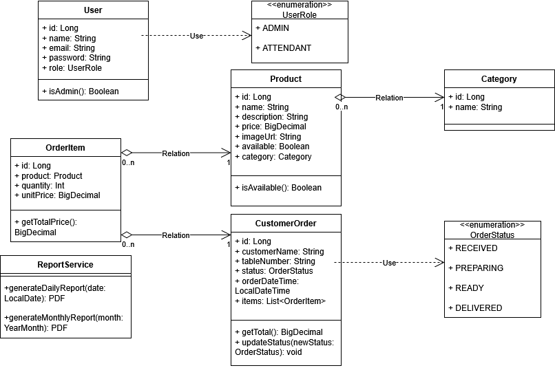
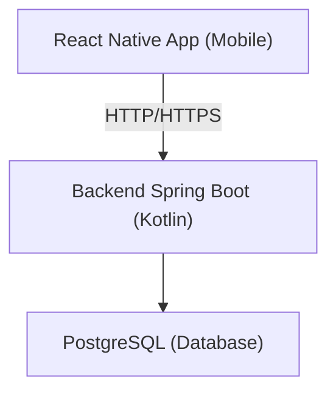
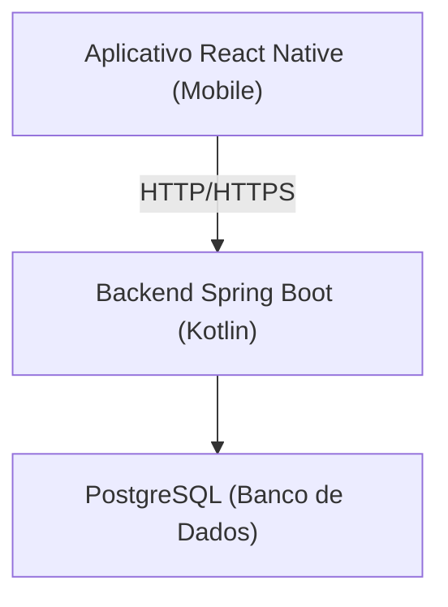

# 🧱 System Architecture

This document describes the overall architecture of the **Digital Menu** system, highlighting the prototype, diagrams, backend/frontend architecture, authentication flow, report generation, tests, CI/CD pipeline, monitoring, and folder structure.

---

## 🧪 Prototype

The prototype includes all key application screens, designed for a smooth and intuitive mobile experience.

> 🖼️ **Screenshots will be added here.**

---

## 📊 Diagrams

> 📎 **Use Case Diagram**

**Administrator**

- **Login**: Access the admin panel using email and password.
- **Manage Menu**: Add, edit, and delete items (name, description, price, image).
- **Manage Categories**: Create, edit, or delete categories (e.g., Drinks, Meals, Desserts).
- **View Orders**: List submitted orders with statuses and details.
- **Update Order Status**: Mark orders as received, in preparation, ready, delivered.
- **Generate Reports**: Export PDF reports by date, total value, top-selling products, etc.

**Customer**

- **Access Menu**: Browse items by category.
- **Filter or Search Items**: Search products by name or category.
- **Place Order**: Select and submit items to the restaurant.
- **Track Order Status (optional)**: View real-time order status updates.
- **Receive Confirmation**: See a success message after placing an order.

> 📎 **Class diagram attached:** 

- 

**Key Relationships**

- Product → Category (Many to One)
- Order → OrderItem (One to Many)
- OrderItem → Product (Many to One)
- User is either ADMIN or CUSTOMER (same table, different roles)

---

## 🧱 Architecture Overview

The system follows a **Clean Architecture-inspired** layered design.

### 🧩 3-Tier Architecture



---

### 📱 **Frontend (React Native with Expo + TypeScript)**

- **Main folders:**
    - `screens/`: main app pages
    - `components/`: reusable UI components
    - `services/`: API communication (via `fetch` or `axios`)
    - `contexts/` or `store/`: global state with Zustand or Context API
    - `utils/`: helper functions
    - `assets/`: images, fonts, icons

---

### 🔙 **Backend (Kotlin + Spring Boot)**

- **Application layers (MVC + domain layers):**
    - `controller`: handles HTTP requests
    - `service`: business logic
    - `repository`: database communication (JPA/Hibernate)
    - `model`: database-mapped entities
    - `dto`: input/output objects (Data Transfer Objects)
    - `mapper`: maps between DTOs and entities
    - `config`: configuration for security, CORS, JWT, etc.

---

### 🔒 **Authentication**

- **Backend:**
    - JWT (JSON Web Token)
    - Spring Security
- **Frontend:**
    - Store token with `AsyncStorage`
    - Send token in `Authorization` header on requests

---

### 📄 **Report Generation (PDF)**

- **Backend:**
    - PDF generation using `OpenPDF`
- **Frontend:**
    - View/download using `expo-print` + `expo-sharing`

---

### ☁️ **Local Storage (Cache / Token)**

- **Frontend**: `AsyncStorage`
- **Backend**: Persistent database (PostgreSQL)

---

### 🧪 **Testing**

- **Backend**:
    - `JUnit` and `Mockito`
- **Frontend**:
    - `Jest` and `React Native Testing Library`

---

### 🚀 **Extras**

- **Docker**: run backend and PostgreSQL using containers
- **CI/CD**: automate testing and deployment (e.g., GitHub Actions)
- **Monitoring**: logs and metrics via `Spring Boot Actuator`
- **Email**: send confirmations, reports, etc. using Spring Mail

---

## 🗂️ Folder Structure

### Frontend Structure (Mobile App)

```tsx
/mobile-app/
├── assets/                     # Images, fonts, icons, etc.
├── components/                 # Reusable components (e.g., Button, Header, MenuItem)
├── screens/                    # Main pages (e.g., Login, Menu, Order, Admin)
├── services/                   # API services (e.g., api.ts)
├── store/                      # Global state (Zustand or Context API)
├── navigation/                 # Navigation setup (stack, tab, etc.)
├── hooks/                      # Custom hooks
├── utils/                      # Utility functions (formatting, validation, etc.)
├── types/                      # Global types/interfaces
├── theme/                      # App theme, colors, fonts, global styles
├── constants/                  # Constants (e.g., API URLs, enums)
├── App.tsx                     # App entry point
└── app.json                    # Expo configuration
```

### Backend Structure

```kotlin
/backend/
└── src/main/kotlin/com/yourproject/
├── controller/            # REST API endpoints
├── service/               # Business logic
├── repository/            # Database access layer (JPA)
├── model/                 # Entities and Enums
├── dto/                   # Data Transfer Objects
├── mapper/                # DTO ↔ Entity converters
├── config/                # App config (security, JWT, CORS, etc.)
├── exception/             # Custom error handling
├── security/              # JWT, authentication filters
├── utils/                 # Utility classes and helpers
└── Application.kt         # Main application entry point

└── src/main/resources/
├── application.yml        # Configuration (port, DB, JWT, etc.)
└── static/ or templates/  # For PDF generation (if needed)
```

---

## 🛠️ Additional Notes

- **Tests**
    - `src/test/kotlin/...`: unit and integration tests
- **Docker**
    - `Dockerfile`, `docker-compose.yml`: for PostgreSQL or backend setup
- **Documentation**
    - `/docs` folder with diagrams, ER model, and other supporting files


---


# 🧱 Arquitetura do Sistema

Este documento descreve a arquitetura geral do sistema **Cardápio Digital**, destacando o protótipo, diagramas, arquitetura backend/frontend, fluxo de autenticação, geração de relatórios, testes, pipeline de CI/CD, monitoramento e estrutura de pastas.

---

## 🧪 Protótipo

O protótipo inclui todas as telas principais do aplicativo, projetado para uma experiência mobile suave e intuitiva.

> 🖼️ **Capturas de tela serão adicionadas aqui.**

---

## 📊 Diagramas

> 📎 **Diagrama de casos de uso**

**Administrador**

- Login: Acessa o sistema de gerenciamento com nome de usuário e senha.
- Gerenciar Cardápio: Adiciona, edita e remove itens (nome, descrição, preço, imagem).
- Gerenciar Categorias: Cria, edita ou exclui categorias (ex: Bebidas, Refeições, Sobremesas).
- Visualizar Pedidos: Lista os pedidos recebidos com status e detalhes.
- Atualizar Status do Pedido: Marca pedidos como recebido, em preparo, pronto, entregue.
- Gerar Relatórios: Exporta relatórios em PDF por data, valor total, produtos mais vendidos etc.

**Cliente**

- Acessar Cardápio: Navega pelos itens por categoria.
- Filtrar ou Buscar Itens: Busca produtos por nome ou categoria.
- Fazer Pedido: Seleciona e envia itens ao restaurante.
- Acompanhar Status do Pedido (opcional): Vê atualizações em tempo real do pedido.
- Receber Confirmação: Recebe mensagem de sucesso após o envio do pedido.

> 📎 **Diagrama classes:**

- 

**Principais Relacionamentos**

- Produto → Categoria (Muitos para Um)
- Pedido → PedidoItem (Um para Muitos)
- PedidoItem → Produto (Muitos para Um)
- Usuário é ADMIN ou CLIENTE (mesma tabela, papéis diferentes)

---

## 🧱 Visão Geral da Arquitetura

O sistema segue um design em camadas inspirado na **Clean Architecture**.

### Arquitetura em 3 camadas



---

### 📱 **Frontend (React Native with Expo + TypeScript)**

- **pastas:**
    - `screens/`: telas principais
    - `components/`: componentes reutilizáveis
    - `services/`: comunicação com API (fetch ou axios)
    - `contexts/` or `store/`: estado global (Zustand ou Context API)
    - `utils/`: funções auxiliares
    - `assets/`: imagens, fontes etc.

---

### 🔙 **Backend (Kotlin + Spring Boot)**

- **Application layers (MVC + domain layers):**
    - `controller`: lida com requisições HTTP
    - `service`: lógica de negócio
    - `repository`: acesso ao banco (JPA/Hibernate)
    - `model`: entidades mapeadas
    - `dto`: objetos de entrada/saída da API
    - `mapper`: conversão entre DTO e Entity
    - `config`: configurações (segurança, JWT, CORS)

---

### 🔒 **Autenticação**

- **Backend:**
    - JWT (JSON Web Token)
    - Spring Security
- **Frontend:**
    - Armazena o token com `AsyncStorage`
    - Adiciona token no cabeçalho `Authorization` header on requests

---

### 📄 **Report Generation (PDF)**

- **Backend:**
    - Geração com `OpenPDF`
- **Frontend:**
    - Visualização/download com `expo-print` + `expo-sharing`

---

### ☁️ **Local Storage (Cache / Token)**

- **Frontend**: `AsyncStorage`
- **Backend**: banco persistente (PostgreSQL)

---

### 🧪 **Testing**

- **Backend**:
    - `JUnit` e `Mockito`
- **Frontend**:
    - `Jest` e `React Native Testing Library`

---

### 🚀 **Extras**

- **Docker**: rodar o backend com PostgreSQL
- **CI/CD**: automatizar testes e deploy (com GitHub Actions ou outra ferramenta)
- **Monitoring**: logs com `Spring Boot Actuator`
- **Email**: envio de confirmação e relatórios com Spring Mail

---

## 🗂️ Folder Structure

### Frontend Structure (Mobile App)

```tsx
/mobile-app/
├── assets/                     # Images, fontes, icones, etc.
├── components/                 # Componentes reutilizáveis (ex: Botão, Header, CardápioItem)
├── screens/                    # Telas principais (ex: Login, Cardápio, Pedido, Admin)
├── services/                   # Requisições HTTP (ex: api.ts)
├── store/                      # Estado global (Zustand ou Context API)
├── navigation/                 # Arquivos de navegação (stack, tab etc.)
├── hooks/                      # Hooks customizados
├── utils/                      # Funções utilitárias (formatação, validações etc.)
├── types/                      # Tipagens globais (interfaces, types)
├── theme/                      # Tema do app, cores, fontes, estilos globais
├── constants/                  # Constantes (ex: URLs, enums)
├── App.tsx                     # Entrada do app
└── app.json                    # Configuração do Expo
```

### Backend Structure

```kotlin
/backend/
└── src/main/kotlin/com/yourproject/
├── controller/            # Controllers (REST APIs)
├── service/               # Regras de negócio
├── repository/            # Acesso ao banco (JPA)
├── model/                 # Entidades (Entities + Enum)
├── dto/                   # Objetos de transferência de dados
├── mapper/                # Conversão entre DTOs e Entities
├── config/                # Configurações (segurança, JWT, CORS, etc.)
├── exception/             # Tratamento de erros (exceptions personalizadas)
├── security/              # JWT, autenticação, filtros
├── utils/                 # Funções auxiliares
└── Application.kt         # Main da aplicação

└── src/main/resources/
├── application.yml        # Configurações (porta, DB, JWT, etc.)
└── static/ or templates/  # (se necessário, para geração de PDF/relatórios)
```

---

## 🛠️ Additional Notes

- **Tests**
    - `src/test/kotlin/...`: testes unitários e de integração
- **Docker**
    - `Dockerfile`, `docker-compose.yml`: para PostgreSQL ou o backend
- **Documentation**
    - `/docs` com imagens, modelo ER ou arquivos de suporte
