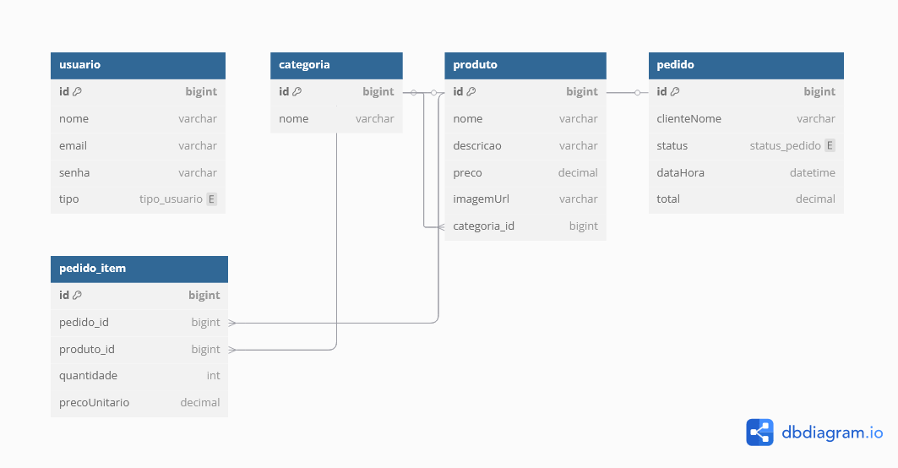

# 🗃️ Database Modeling

This document describes the database modeling used in the **Digital Menu** system, including the ER diagram, table descriptions, and applied migrations.

---

## 📊 ER Diagram

The diagram below visually represents the main entities, attributes, and relationships of the system.

- 

---

## 📋 Documented Tables

### 🧑‍💼 Table: `users`

| Attribute   | Type           | Description                     | Constraints                                |
|-------------|----------------|---------------------------------|--------------------------------------------|
| `id`        | bigint         | Unique identifier for the user  | Primary key, auto-increment                |
| `name`      | varchar(100)   | Full name of the user           | Not null                                   |
| `email`     | varchar(100)   | User's email (used as login)    | Unique, not null                           |
| `password`  | varchar(255)   | Encrypted password              | Not null                                   |
| `type`      | varchar(20)    | User type                       | Not null (e.g., ADMIN, CLIENT)             |

---

### 🏷️ Table: `category`

| Attribute | Type         | Description             | Constraints                      |
|-----------|--------------|-------------------------|----------------------------------|
| `id`      | bigint       | Category ID             | Primary key, auto-increment      |
| `name`    | varchar(100) | Category name           | Not null                         |

---

### 🍔 Table: `product`

| Attribute     | Type           | Description                         | Constraints                                           |
|---------------|----------------|-------------------------------------|--------------------------------------------------------|
| `id`          | bigint         | Product ID                          | Primary key, auto-increment                            |
| `name`        | varchar(100)   | Product name                        | Not null                                               |
| `description` | text           | Detailed description of the product | Optional                                               |
| `price`       | decimal(10, 2) | Unit price                          | Not null                                               |
| `category_id` | bigint         | Foreign key to `category`           | Not null, references `category(id)`                    |

---

### 🧾 Table: `customer_order`

| Attribute      | Type     | Description                                 | Constraints                                                  |
|----------------|----------|---------------------------------------------|---------------------------------------------------------------|
| `id`           | bigint   | Unique order identifier                     | Primary key, auto-increment                                   |
| `clienteNome`  | varchar  | Customer name (no login required)           | Optional                                                      |
| `status`       | enum     | Current order status                        | Values: RECEIVED, PREPARING, READY, DELIVERED                 |
| `dataHora`     | datetime | Date and time when the order was placed     | Not null                                                      |
| `total`        | decimal  | Total order amount                          | Not null                                                      |

---

### 📦 Table: `order_item`

| Attribute     | Type           | Description                              | Constraints                                          |
|---------------|----------------|------------------------------------------|------------------------------------------------------|
| `id`          | bigint         | Order item ID                            | Primary key, auto-increment                          |
| `order_id`    | bigint         | Foreign key to `customer_order`          | Not null, references `customer_order(id)`            |
| `product_id`  | bigint         | Foreign key to `product`                 | Not null, references `product(id)`                   |
| `quantity`    | int            | Quantity of the product ordered          | Not null                                             |
| `unit_price`  | decimal(10, 2) | Unit price at the time of the order      | Not null                                             |

---

## 🛠️ Applied Migrations

| Migration Name                      | Description                                                                  |
|------------------------------------|------------------------------------------------------------------------------|
| `V1__create_user_table.sql`        | Creates the `users` table with: id, name, email, password, type              |
| `V2__create_category_table.sql`    | Creates the `category` table with: id, name                                  |
| `V3__create_product_table.sql`     | Creates the `product` table with: id, name, description, price, category_id  |
| `V4__create_order_table.sql`       | Creates the `customer_order` table with: id, clienteNome, status, dataHora, total |
| `V5__create_order_item_table.sql`  | Creates the `order_item` table with: id, order_id, product_id, quantity, unit_price |
| `V6__relacionamentos.sql`          | Adds foreign keys: product → category, order_item → product, order_item → customer_order |

---

# 🗃️ Modelagem de Banco de Dados

Este documento descreve a modelagem do banco de dados utilizada no sistema **Digital Menu**, incluindo o diagrama ER, descrição das tabelas e migrations aplicadas.

---

## 📊 Diagrama ER

O diagrama abaixo representa visualmente as entidades, atributos e os relacionamentos principais do sistema.

- 

---

## 📋 Tabelas Documentadas

### 🧑‍💼 Tabela: `users`

| Atributo   | Tipo           | Descrição                        | Restrições                             |
|------------|----------------|----------------------------------|----------------------------------------|
| `id`       | bigint         | Identificador único do usuário   | Primary key, auto-increment            |
| `name`     | varchar(100)   | Nome completo do usuário         | Not null                               |
| `email`    | varchar(100)   | Email do usuário (login)         | Unique, not null                       |
| `password` | varchar(255)   | Senha criptografada              | Not null                               |
| `type`     | varchar(20)    | Tipo do usuário                  | Not null (e.g., ADMIN, CLIENT)         |

---

### 🏷️ Tabela: `category`

| Atributo | Tipo         | Descrição                  | Restrições                         |
|----------|--------------|----------------------------|------------------------------------|
| `id`     | bigint       | Identificador da categoria | Primary key, auto-increment        |
| `name`   | varchar(100) | Nome da categoria          | Not null                           |

---

### 🍔 Tabela: `product`

| Atributo      | Tipo           | Descrição                           | Restrições                                       |
|---------------|----------------|-------------------------------------|--------------------------------------------------|
| `id`          | bigint         | Identificador do produto            | Primary key, auto-increment                      |
| `name`        | varchar(100)   | Nome do produto                     | Not null                                         |
| `description` | text           | Descrição detalhada do produto      | Optional                                         |
| `price`       | decimal(10, 2) | Preço unitário                      | Not null                                         |
| `category_id` | bigint         | Chave estrangeira para `category`   | Not null, references `category(id)`              |

---

### 🧾 Tabela: `customer_order`

| Atributo      | Tipo     | Descrição                              | Restrições                                                    |
|---------------|----------|----------------------------------------|---------------------------------------------------------------|
| `id`          | bigint   | Identificador único do pedido          | Primary key, auto-increment                                   |
| `clienteNome` | varchar  | Nome do cliente (sem login obrigatório)| Optional                                                      |
| `status`      | enum     | Status atual do pedido                 | Values: RECEIVED, PREPARING, READY, DELIVERED                 |
| `dataHora`    | datetime | Data e hora do pedido                  | Not null                                                      |
| `total`       | decimal  | Valor total do pedido                  | Not null                                                      |

---

### 📦 Tabela: `order_item`

| Atributo     | Tipo           | Descrição                                | Restrições                                           |
|--------------|----------------|------------------------------------------|------------------------------------------------------|
| `id`         | bigint         | Identificador do item do pedido          | Primary key, auto-increment                          |
| `order_id`   | bigint         | Chave estrangeira para o pedido          | Not null, references `customer_order(id)`            |
| `product_id` | bigint         | Chave estrangeira para o produto         | Not null, references `product(id)`                   |
| `quantity`   | int            | Quantidade do produto                    | Not null                                             |
| `unit_price` | decimal(10, 2) | Preço unitário no momento do pedido      | Not null                                             |

---

## 🛠️ Migrations Criadas

| Nome da Migration                 | Descrição                                                                                |
|-----------------------------------|------------------------------------------------------------------------------------------|
| `V1__create_user_table.sql`       | Creates the `users` table with: id, name, email, password, type                          |
| `V2__create_category_table.sql`   | Creates the `category` table with: id, name                                              |
| `V3__create_product_table.sql`    | Creates the `product` table with: id, name, description, price, category_id              |
| `V4__create_order_table.sql`      | Creates the `customer_order` table with: id, clienteNome, status, dataHora, total        |
| `V5__create_order_item_table.sql` | Creates the `order_item` table with: id, order_id, product_id, quantity, unit_price      |
| `V6__relacionamentos.sql`         | Adds foreign keys: product → category, order_item → product, order_item → customer_order |

---

